# AMR Map Editor 사용 설명서 (처음 쓰는 분용)

AMR 맵(`.pgm`)을 열어 **지저분한 점을 지우고, 벽을 반듯하게 하고, 업데이트로 틀어진 부분을 되돌리는** 프로그램입니다.
이 문서는 처음 쓰는 분이 10분 안에 기본 작업을 해 볼 수 있도록 화면과 짧은 동영상(GIF)으로 설명합니다.

> 모든 화면은 저장소의 `samples/` 폴더에 있는 예제 맵으로 찍었습니다. 같은 파일로 그대로 따라 해 볼 수 있습니다.
> 기능별 자세한 설명은 [README](../../README.md)를 보세요.

**목차**

1. [설치와 실행](#1-설치와-실행)
2. [맵 열기](#2-맵-열기)
3. [화면 구성](#3-화면-구성)
4. [화면 이동 · 확대](#4-화면-이동--확대)
5. [그리기 · 지우기 · 실행 취소](#5-그리기--지우기--실행-취소)
6. [따라 하기 ① 새로 만든 맵 정리](#6-따라-하기--새로-만든-맵-정리)
7. [따라 하기 ② 업데이트로 틀어진 맵 보정](#7-따라-하기--업데이트로-틀어진-맵-보정)
8. [저장](#8-저장)
9. [그 밖의 기능](#9-그-밖의-기능)
10. [자주 쓰는 단축키](#10-자주-쓰는-단축키)
11. [자주 묻는 질문](#11-자주-묻는-질문)

---

## 1. 설치와 실행

1. **[AmrMapEditor.exe 받기](https://github.com/Leepy0/AmrMapEditor/releases/latest/download/AmrMapEditor.exe)** (Windows 10/11 64비트, 약 70 MB)
2. 받은 파일을 **문서 · 바탕화면 같은 내 폴더**에 두고 더블클릭합니다. 설치 과정은 없습니다.
3. 처음 실행할 때 파란 "Windows의 PC 보호" 창이 뜨면 **추가 정보 › 실행**을 누릅니다.
   (코드 서명을 하지 않은 프로그램이라 뜨는 안내입니다. 한 번만 하면 됩니다.)

더블클릭하면 진행 막대와 "약 N초 남음"이 있는 작은 시작 창이 먼저 뜨고, 잠시 뒤 아래 화면이 나옵니다. (새 버전을 처음 실행할 때는 Windows가 파일을 검사하느라 창이 뜨기까지 몇 초 더 걸릴 수 있습니다.)

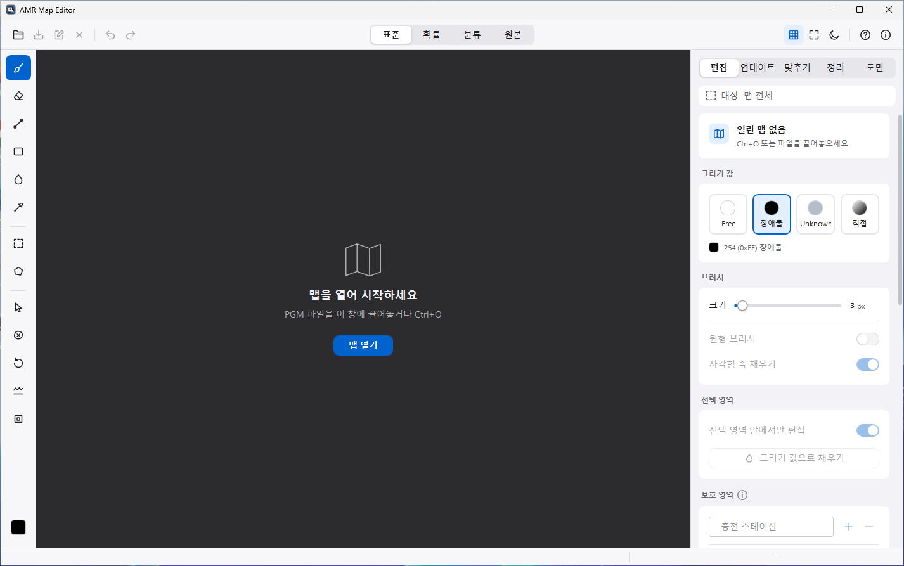

> 💡 새 버전이 나오면 아래 상태 표시줄에 **새 버전** 표시가 뜹니다. 눌러서 받아 두면 프로그램을 닫을 때 바뀝니다.

## 2. 맵 열기

다음 셋 중 편한 방법을 쓰면 됩니다.

- 가운데 **맵 열기** 버튼 또는 왼쪽 위 📂 버튼 (`Ctrl+O`)
- 탐색기에서 `.pgm` 파일을 창 위로 **끌어다 놓기**
- `.pgm` 파일을 `AmrMapEditor.exe` 아이콘 위로 끌어다 놓기

같은 폴더에 같은 이름의 `.yaml` 파일이 있으면 해상도와 원점(origin)도 함께 읽습니다.

## 3. 화면 구성

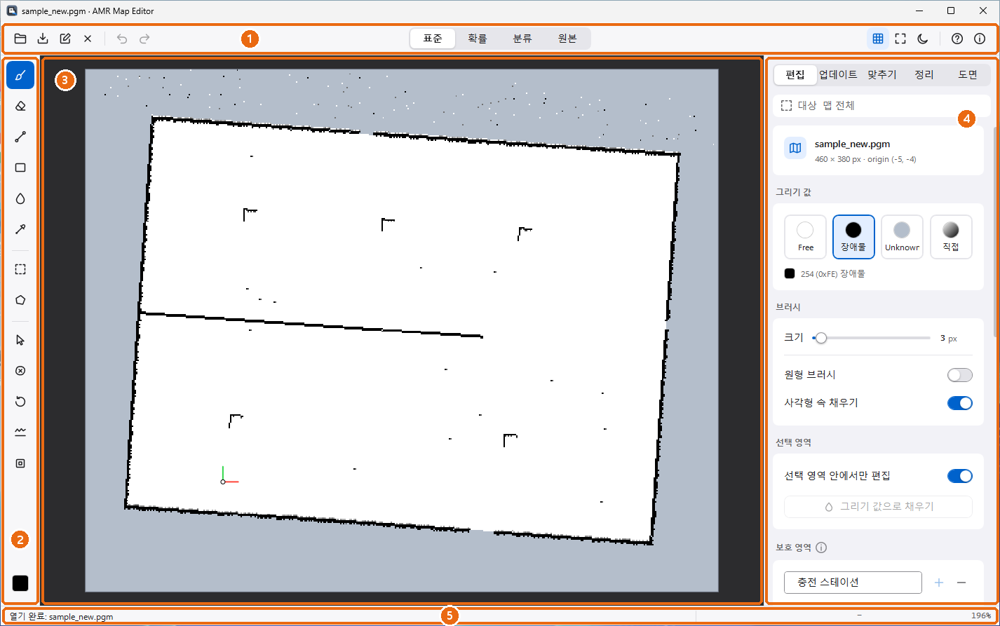

| 번호 | 이름 | 하는 일 |
|:-:|---|---|
| **1** | 도구 막대 | 열기 · 저장 · 실행 취소, 가운데는 맵 표시 방식(표준 · 확률 · 분류 · 원본), 오른쪽은 화면 맞춤 · 다크 모드 · 도움말 |
| **2** | 도구 | 브러시, 지우개, 선택, 벽 직선화 같은 편집 도구. 맨 아래 색 칸이 지금 칠할 값 |
| **3** | 맵 | 작업 화면. 확대 · 이동하며 편집 |
| **4** | 오른쪽 패널 | 작업별 탭: **편집 · 업데이트 · 맞추기 · 정리 · 도면** (`Ctrl+1`~`5`) |
| **5** | 상태 표시줄 | 왼쪽은 방금 한 작업 결과(**되돌리기** 링크), 오른쪽은 커서 위치의 값 · 좌표 · 배율 |

맵의 색은 이렇게 읽습니다.

| 색 | 의미 | 값 |
|---|---|---|
| ⬜ 흰색 | 다닐 수 있는 곳 (Free) | 1 |
| ⬛ 검정 | 벽 · 장애물 | 254 |
| 청회색 | 모르는 곳 (Unknown, 스캔 안 된 곳) | 0 |

**버튼 이름을 모르겠으면 마우스를 올려 보세요.** 이름 · 단축키 · 짧은 설명이 나옵니다.

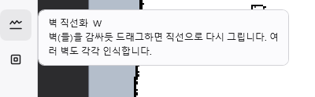

## 4. 화면 이동 · 확대

| 하고 싶은 것 | 방법 |
|---|---|
| 확대 / 축소 | 마우스 **휠** (커서 위치 기준) |
| 화면 이동 | **휠 버튼(가운데 버튼)을 누른 채 끌기**, 또는 **Space + 끌기** |
| 맵 전체 보기 | `F` 또는 도구 막대의 화면 맞춤 버튼 |

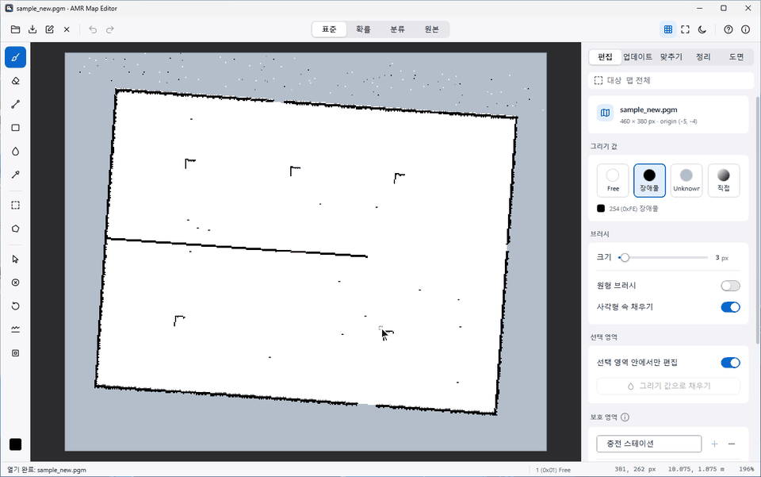

## 5. 그리기 · 지우기 · 실행 취소

1. 칠할 값을 고릅니다: `1` = Free(흰색), `2` = 장애물(검정), `3` = Unknown. (편집 탭의 **그리기 값**에서 눌러도 됩니다.)
2. 브러시(`B`)로 맵 위를 끌면 칠해집니다. 브러시 크기는 `[` `]`.
3. 지우개(`E`)는 Free(흰색)로 칠합니다.
4. 잘못했으면 `Ctrl+Z` (실행 취소), 다시 하려면 `Ctrl+Y`. 100단계까지 됩니다.

> 💡 직선은 `L`, 사각형은 `R`, 같은 색 영역 채우기는 `G`를 씁니다.

## 6. 따라 하기 ① 새로 만든 맵 정리

예제 파일: `samples/sample_new.pgm` — 4° 기울어져 있고, 작은 점(노이즈) · 울퉁불퉁한 벽 · 한두 면만 찍힌 기둥이 있는 맵입니다.

오른쪽 패널의 **정리** 탭(`Ctrl+4`)을 엽니다. 위에서부터 필요한 것만 하면 됩니다.

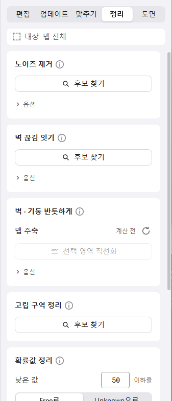

### ① 기둥을 사각형으로 (도구 `C`)

`C`를 누르고 기둥을 하나씩 클릭하면 덩어리를 감싸는 사각형으로 바뀝니다. 한두 면만 찍힌 ㄱ자 모양도 사각형이 됩니다.

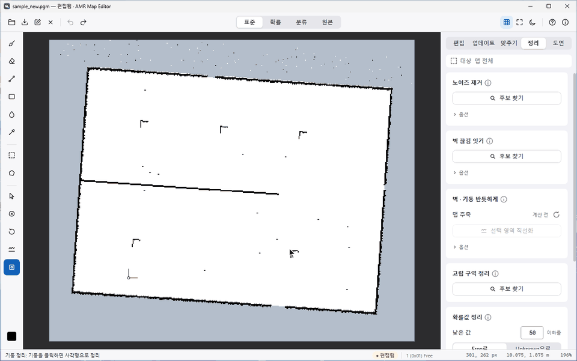

> 작은 기둥은 다음 단계의 노이즈 조건에도 걸릴 수 있으니 **노이즈 제거보다 먼저** 정리하세요.

### ② 노이즈(작은 점) 지우기

1. **노이즈 제거 › 후보 찾기**를 누릅니다. 지울 후보가 맵에 상자로, 패널에 목록으로 나옵니다.
2. 목록에서 지우면 안 되는 것은 체크를 풉니다. (목록을 누르면 그 위치로 이동합니다.)
3. **체크한 항목 삭제**를 누릅니다.

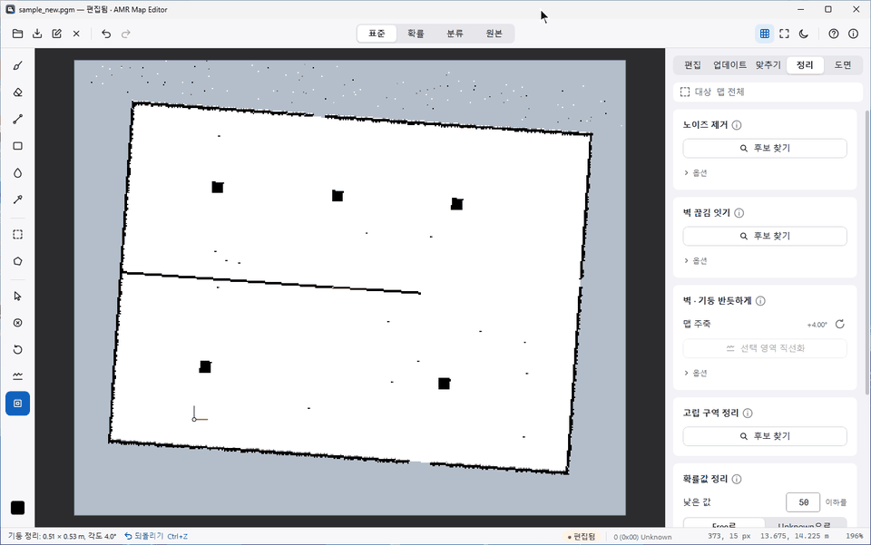

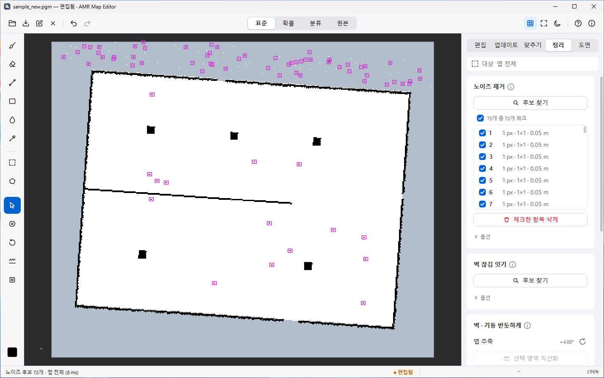

지운 뒤에는 상태 표시줄에 결과와 **되돌리기** 링크가 나옵니다. 확인창 없이 바로 실행되지만 언제든 `Ctrl+Z`로 되돌릴 수 있습니다.

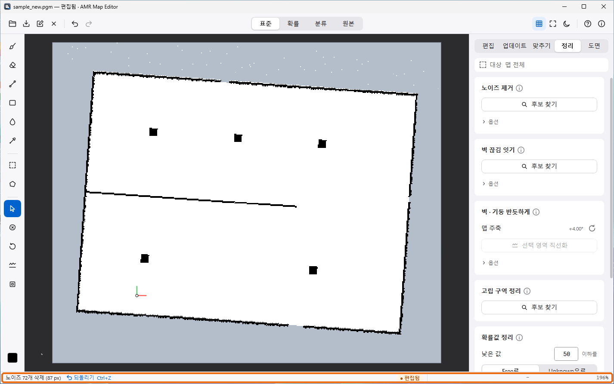

### ③ 기울기 보정 (맵을 반듯하게 돌리기)

정리 탭 맨 아래 **기울기 보정 › 주축에 맞춰 회전**을 누르면 바로 회전합니다. 상태 표시줄에 각도와 바뀐 크기가 나옵니다.

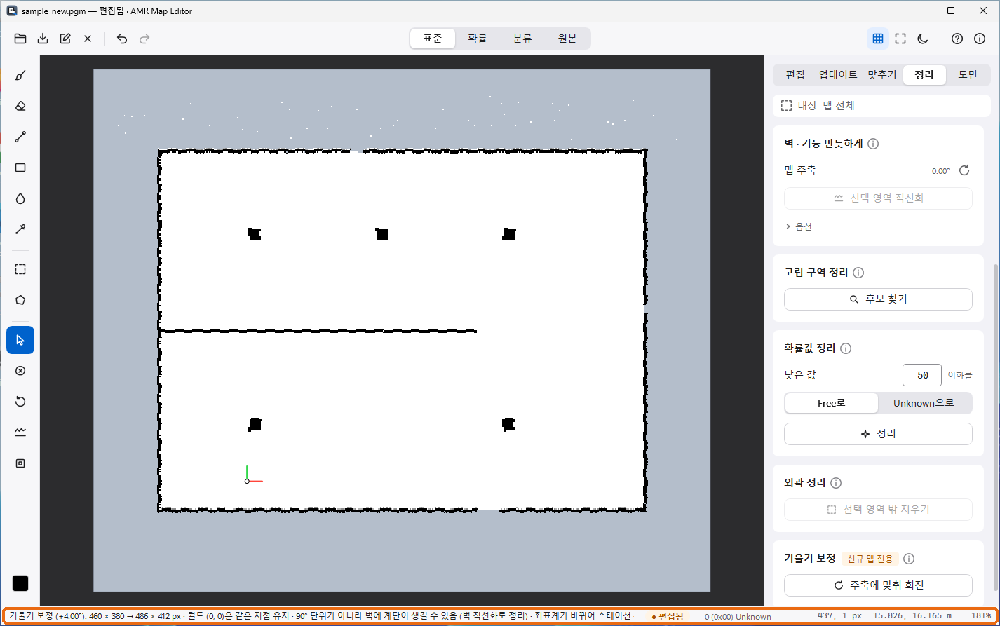

> ⚠️ 회전하면 맵 크기와 좌표가 바뀝니다. **스테이션 · 경로를 티칭하기 전의 새 맵에만** 쓰세요.
> 월드 (0, 0) 지점은 맵에서 같은 곳에 남습니다. 마음에 들지 않으면 `Ctrl+Z`로 회전 전으로 돌아갑니다.
> 원하는 각도로 돌리거나 원점을 바꾸려면 **편집 탭 › 회전 · 크기 · 원점**을 쓰세요 (9장).

### ④ 벽을 직선으로 (도구 `W`)

`W`를 누르고 울퉁불퉁한 벽을 **감싸도록 끌어서** 놓으면 그 벽이 곧은 선으로 다시 그려집니다. 영역 안에 벽이 여러 개 있어도 각각 처리합니다.

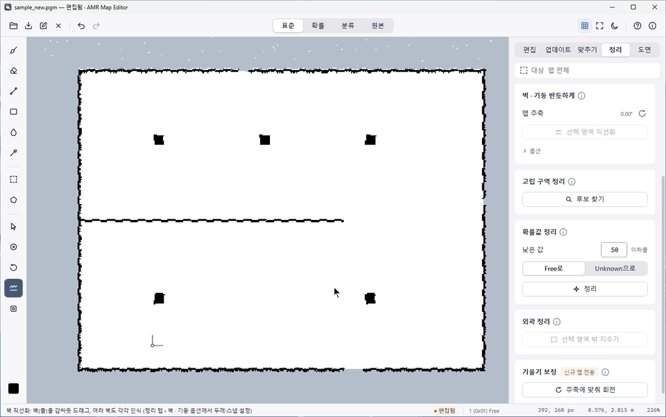

### ⑤ 그 밖의 정리 (필요할 때)

| 카드 | 언제 쓰나 |
|---|---|
| 벽 끊김 잇기 | 유리 · 반사면 때문에 벽이 끊겨 있을 때 (출입구도 후보로 잡히니 확인 후 체크) |
| 고립 구역 정리 | 닫힌 방 안이나 창문 너머에 찍힌 점을 Unknown으로 |
| 확률값 정리 | 흐린 회색(확률값)을 Free / 장애물로 정리 |
| 외곽 정리 | 건물 외곽을 폴리곤(`P`)으로 선택한 뒤 바깥을 모두 Unknown으로 |

## 7. 따라 하기 ② 업데이트로 틀어진 맵 보정

예제 파일: `samples/sample_updated.pgm`(업데이트된 맵) + `samples/sample_before.pgm`(업데이트 전 맵)

업데이트 중 위치 인식이 틀어져 **벽이 두 겹으로 그려지거나, 엉뚱한 곳이 바뀐** 맵을 업데이트 전 맵과 비교해 바로잡습니다.

### ① 맵 열고 기준 맵 열기

1. 업데이트된 맵(`sample_updated.pgm`)을 엽니다.
2. **업데이트** 탭(`Ctrl+2`)에서 **기준 맵 열기**를 눌러 업데이트 **전** 맵(`sample_before.pgm`)을 고릅니다.

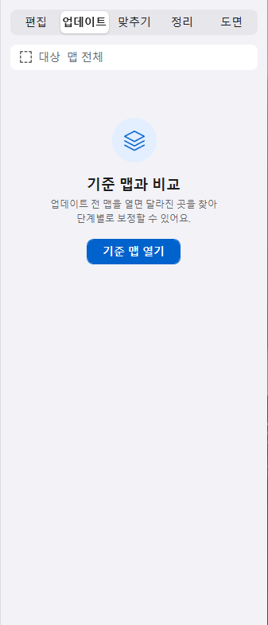

달라진 곳이 색으로 표시됩니다: **빨강** = 새로 생긴 장애물, **파랑** = 사라진 장애물, **노랑** = 그 밖의 변화.
패널에는 단계 카드가 나오고, 끝낸 단계는 번호가 **초록 체크**로 바뀝니다.

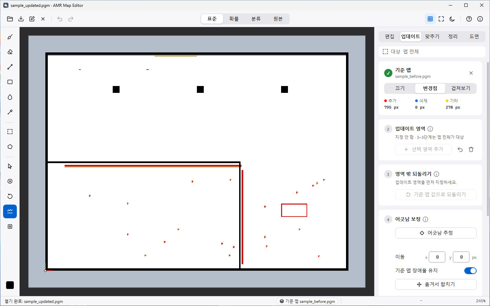

### ② 업데이트 영역 지정

이번에 실제로 다시 스캔한 범위를 알려 주는 단계입니다.
영역 선택(`M`)으로 맵 위를 끌어 사각형을 그린 뒤 **선택 영역 추가**를 누릅니다. (여러 개 추가할 수 있습니다.)

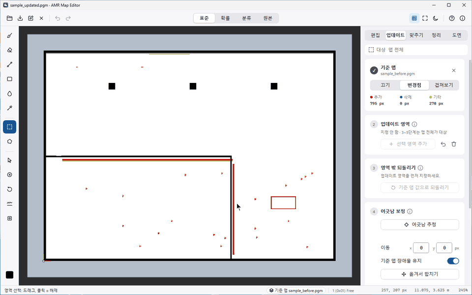

### ③ 영역 밖 되돌리기

**기준 맵 값으로 되돌리기**를 누르면 업데이트 영역 **밖**에서 바뀐 것(잘못 바뀐 곳)이 모두 원래대로 돌아갑니다.

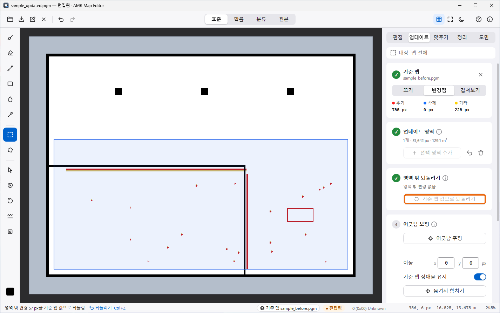

### ④ 어긋남 보정

**어긋남 추정**을 누르면 업데이트된 부분이 몇 px 밀려 있는지 계산합니다(예제는 x −3, y −4).
값을 확인하고 **옮겨서 합치기**를 누르면 밀린 만큼 옮겨서 기존 벽에 맞춥니다. 두 겹이던 벽이 하나가 됩니다.

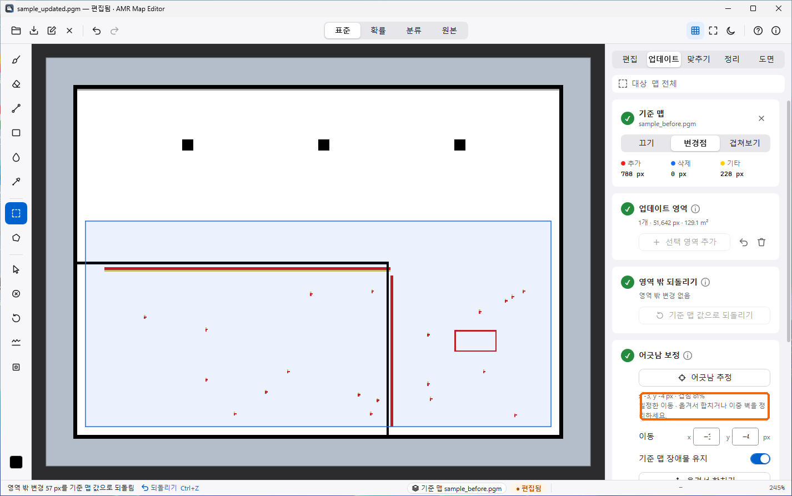

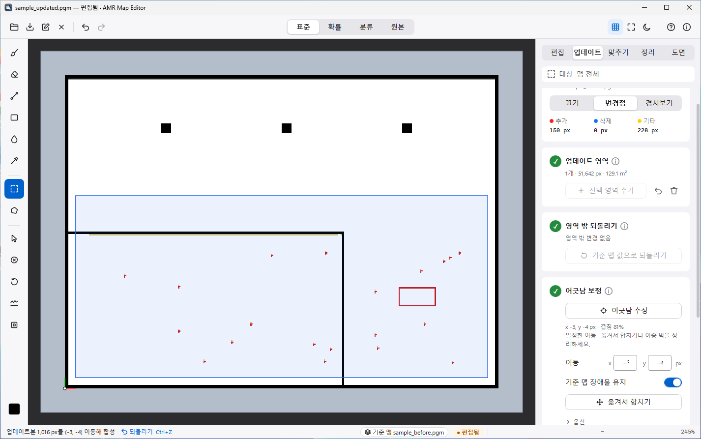

### ⑤ 이중 벽 정리 · 변경 확인

- **이중 벽 정리 › 후보 찾기**: 기존 벽 바로 옆에 새로 생긴 덩어리를 찾아 기준 맵 값으로 복원합니다. ④를 했다면 후보가 없을 수 있습니다.
- **변경 영역 확인**: 남은 변경을 목록으로 하나씩 확인합니다. 일부만 되돌리려면 복원 브러시(`H`)로 칠합니다.

### ⑥ 마무리

정리 탭에서 노이즈를 지운 뒤 저장합니다. 모든 단계가 초록 체크면 끝입니다.

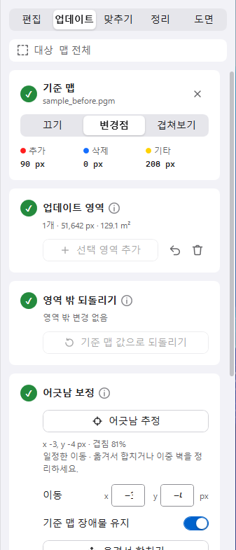

## 8. 저장

`Ctrl+S` (또는 도구 막대 💾). 다른 이름으로 저장은 `Ctrl+Shift+S`.

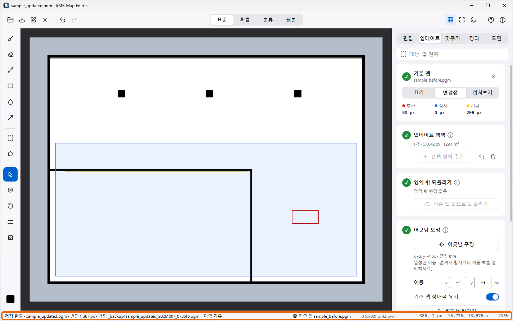

- 원래 파일은 맵 폴더의 **`_backup`** 폴더에 날짜 · 시간 이름으로 자동 백업됩니다. 잘못 저장해도 여기서 되찾을 수 있습니다.
- **`_history`** 폴더에는 무엇이 바뀌었는지 보여 주는 그림(빨강 추가 · 파랑 삭제)과 작업 목록이 남습니다.
- 맵 크기가 바뀌었거나(회전 · 기울기 보정 · 크기 변경 · 합치기) 확인할 내용이 있을 때만 확인창이 뜹니다.
- yaml이 없는 맵에서 원점을 바꾸면 같은 이름의 yaml을 새로 만듭니다.
- 저장하지 않고 닫으려 하면 물어봅니다.

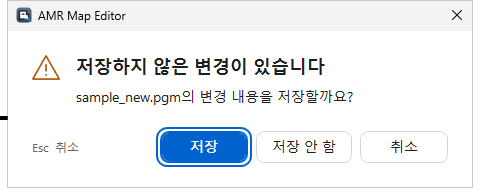

## 9. 그 밖의 기능

| 기능 | 위치 | 한 줄 설명 |
|---|---|---|
| 맵 회전 | **편집** 탭 › 회전 · 크기 · 원점 | 90° · 180° 버튼 또는 각도 입력(+ 반시계). 월드 (0, 0) 지점은 같은 곳에 남고 `Ctrl+Z`로 되돌림 |
| 맵 크기 바꾸기 | **편집** 탭 › 회전 · 크기 · 원점 | 폭 × 높이(px) 입력 후 **크기 적용**. 3 × 3 기준 위치에 기존 맵을 두고 늘어난 곳은 Unknown, 줄이면 잘림. **선택으로 자르기**는 선택 범위에 맞춤. 내용의 월드 좌표는 그대로 |
| 원점 바꾸기 | **편집** 탭 › 회전 · 크기 · 원점 | origin X · Y 입력, 또는 **맵에서 지정**으로 클릭한 곳을 월드 (0, 0)으로. 맵 위 빨강(x) · 초록(y) 화살표가 원점 |
| 다른 맵과 맞추기 · 합치기 | **맞추기** 탭 (`Ctrl+3`) | 나눠 그린 맵을 겹쳐 위치를 맞추고 두 맵 전체를 담는 큰 맵으로 합치기, 일부만 새로 그린 맵을 기존 맵에 반영 |
| 도면(DXF) 겹쳐 보기 | **도면** 탭 (`Ctrl+5`) | 건물 도면을 맵 위에 겹쳐 벽 위치 비교 (`samples/sample_floor.dxf`) |
| 보호 영역 | **편집** 탭 › 보호 영역 | 충전 스테이션 · 반사판처럼 지우면 안 되는 곳을 선택해 두면 어떤 편집에서도 바뀌지 않음 |
| 다크 모드 | 도구 막대 🌙 | 어두운 화면. 맵 색은 그대로 |
| 버전 · 업데이트 | 도구 막대 ⓘ | 버전 확인, 새 버전 받기, 이전 버전으로 되돌리기 |

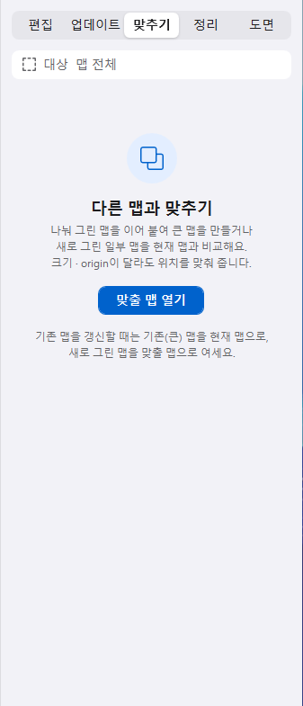
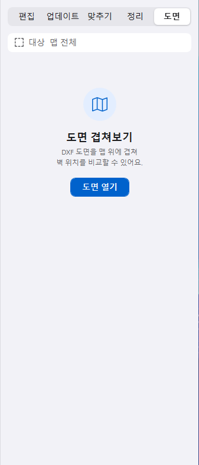

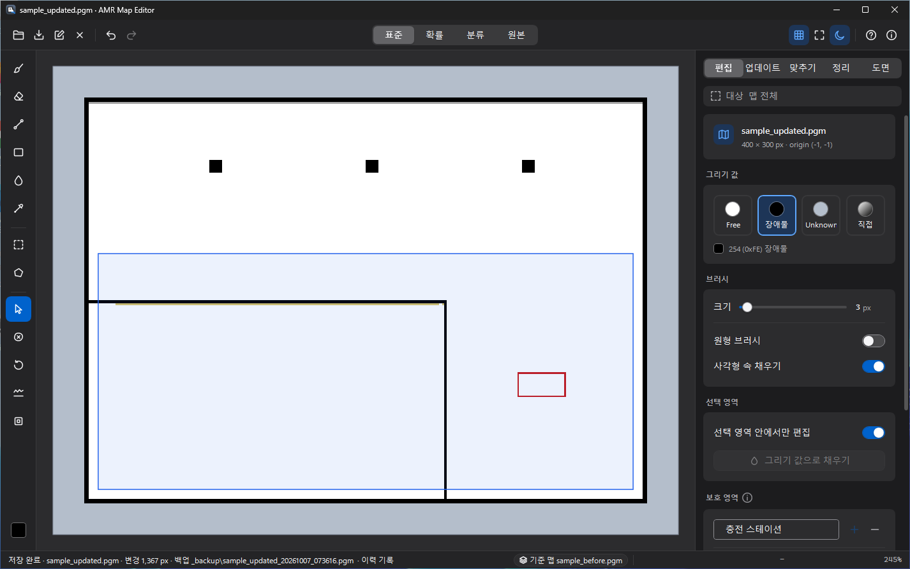

## 10. 자주 쓰는 단축키

| 키 | 동작 | 키 | 동작 |
|---|---|---|---|
| `Ctrl+O` | 열기 | `B` | 브러시 |
| `Ctrl+S` | 저장 | `E` | 지우개 |
| `Ctrl+Z` / `Ctrl+Y` | 실행 취소 / 다시 실행 | `M` | 사각형 영역 선택 |
| `F` | 맵 전체 보기 | `P` | 폴리곤 선택 (더블클릭으로 완료) |
| 휠 | 확대 / 축소 | `D` | 클릭한 덩어리 통째로 지우기 |
| 가운데 버튼 · Space + 끌기 | 화면 이동 | `W` | 벽 직선화 |
| `1` `2` `3` | Free · 장애물 · Unknown | `C` | 기둥 정리 |
| `[` `]` | 브러시 크기 | `H` | 복원 브러시 (기준 맵 값으로) |
| `Ctrl+1`~`5` | 오른쪽 탭 바꾸기 | `Esc` / `Ctrl+D` | 선택 해제 · 진행 중인 작업 취소 |

도구 막대의 **?** 버튼에 마우스를 올려도 단축키 목록이 나옵니다.

## 11. 자주 묻는 질문

**Q. 실수로 지웠어요.**
`Ctrl+Z`로 되돌리세요 (100단계). 이미 저장했다면 맵 폴더의 `_backup` 폴더에 저장 직전 파일이 있습니다.

**Q. 버튼이 회색이라 눌리지 않아요.**
선택 영역이 있어야 하는 기능입니다(예: 선택 영역 직선화, 외곽 정리). `M`이나 `P`로 먼저 영역을 선택하세요.

**Q. 브러시로 칠했는데 일부가 칠해지지 않아요.**
선택 영역이 있고 편집 탭의 **선택 영역 안에서만 편집**이 켜져 있으면 선택 영역 밖은 바뀌지 않습니다. 또는 **보호 영역**일 수 있습니다. 패널 위쪽 "대상" 막대의 ✕로 선택을 해제해 보세요.

**Q. 기준 맵을 열었더니 "벽이 많이 어긋난다"는 경고가 나와요.**
따로 그린 맵이거나 좌표계가 다른 맵입니다. 업데이트 탭 대신 **맞추기** 탭에서 여세요.

**Q. 실행할 때 "Windows의 PC 보호" 창이 떠요.**
**추가 정보 › 실행**을 누르면 됩니다. 자동 업데이트로 받은 새 버전은 이 창이 뜨지 않습니다.

---

이 문서의 화면은 [Manual Capture 워크플로](../../.github/workflows/manual-capture.yml)가 실제 프로그램을 자동으로 조작해 찍은 것입니다. 화면이 바뀌면 Actions › Manual Capture › Run workflow로 다시 찍을 수 있습니다 ([방법](../../tools/ManualCapture/README.md)).
